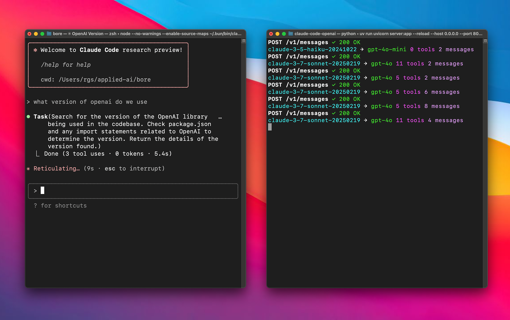

# Anthropic API Proxy for Gemini, OpenAI & Copilot Enterprise 🔄

**Use Anthropic clients (like Claude Code) with Gemini, OpenAI, Copilot Enterprise, or direct Anthropic backends.** 🤝

A proxy server that lets you use Anthropic clients with multiple backends, all via a unified strategy pattern. Also exposes an OpenAI-compatible `/v1/chat/completions` endpoint for other agents and tools. 🌉




## Quick Start ⚡

### Prerequisites

- OpenAI API key 🔑
- Google AI Studio (Gemini) API key (if using Google provider) 🔑
- Google Cloud Project with Vertex AI API enabled (if using Application Default Credentials for Gemini) ☁️
- [uv](https://github.com/astral-sh/uv) installed.

### Setup 🛠️

#### From source

1. **Clone this repository**:
   ```bash
   git clone https://github.com/1rgs/claude-code-proxy.git
   cd claude-code-proxy
   ```

2. **Install uv** (if you haven't already):
   ```bash
   curl -LsSf https://astral.sh/uv/install.sh | sh
   ```
   *(`uv` will handle dependencies based on `pyproject.toml` when you run the server)*

3. **Configure Environment Variables**:
   Copy the example environment file:
   ```bash
   cp .env.example .env
   ```
   Edit `.env` and fill in your API keys and model configurations:

   *   `ANTHROPIC_API_KEY`: (Optional) Needed only if proxying *to* Anthropic models.
   *   `OPENAI_API_KEY`: Your OpenAI API key (Required if using the default OpenAI preference or as fallback).
   *   `GEMINI_API_KEY`: Your Google AI Studio (Gemini) API key (Required if `PREFERRED_PROVIDER=google` and `USE_VERTEX_AUTH=true`).
   *   `USE_VERTEX_AUTH` (Optional): Set to `true` to use Application Default Credentials (ADC) will be used (no static API key required). Note: when USE_VERTEX_AUTH=true, you must configure `VERTEX_PROJECT` and `VERTEX_LOCATION`.
   *   `VERTEX_PROJECT` (Optional): Your Google Cloud Project ID (Required if `PREFERRED_PROVIDER=google` and `USE_VERTEX_AUTH=true`).
   *   `VERTEX_LOCATION` (Optional): The Google Cloud region for Vertex AI (e.g., `us-central1`) (Required if `PREFERRED_PROVIDER=google` and `USE_VERTEX_AUTH=true`).
   *   `PREFERRED_PROVIDER` (Optional): Set to `openai` (default), `google`, or `anthropic`. This determines the primary backend for mapping `haiku`/`sonnet`.
   *   `BIG_MODEL` (Optional): The model to map `sonnet` requests to. Defaults to `gpt-4.1` (if `PREFERRED_PROVIDER=openai`) or `gemini-2.5-pro-preview-03-25`. Ignored when `PREFERRED_PROVIDER=anthropic`.
   *   `SMALL_MODEL` (Optional): The model to map `haiku` requests to. Defaults to `gpt-4.1-mini` (if `PREFERRED_PROVIDER=openai`) or `gemini-2.0-flash`. Ignored when `PREFERRED_PROVIDER=anthropic`.

   **Mapping Logic:**
   - If `PREFERRED_PROVIDER=openai` (default), `haiku`/`sonnet` map to `SMALL_MODEL`/`BIG_MODEL` prefixed with `openai/`.
   - If `PREFERRED_PROVIDER=google`, `haiku`/`sonnet` map to `SMALL_MODEL`/`BIG_MODEL` prefixed with `gemini/` *if* those models are in the server's known `GEMINI_MODELS` list (otherwise falls back to OpenAI mapping).
   - If `PREFERRED_PROVIDER=anthropic`, `haiku`/`sonnet` requests are passed directly to Anthropic with the `anthropic/` prefix without remapping to different models.

4. **Run the server**:
   ```bash
   uv run uvicorn server:app --host 0.0.0.0 --port 8082 --reload
   ```
   *(`--reload` is optional, for development)*

#### Docker

If using docker, download the example environment file to `.env` and edit it as described above.
```bash
curl -O .env https://raw.githubusercontent.com/1rgs/claude-code-proxy/refs/heads/main/.env.example
```

Then, you can either start the container with [docker compose](https://docs.docker.com/compose/) (preferred):

```yml
services:
  proxy:
    image: ghcr.io/1rgs/claude-code-proxy:latest
    restart: unless-stopped
    env_file: .env
    ports:
      - 8082:8082
```

Or with a command:

```bash
docker run -d --env-file .env -p 8082:8082 ghcr.io/1rgs/claude-code-proxy:latest
```

### Using with Claude Code 🎮

1. **Install Claude Code** (if you haven't already):
   ```bash
   npm install -g @anthropic-ai/claude-code
   ```

2. **Connect to your proxy**:
   ```bash
   ANTHROPIC_BASE_URL=http://localhost:8082 claude
   ```

3. **That's it!** Your Claude Code client will now use the configured backend models (defaulting to Gemini) through the proxy. 🎯

## Model Mapping 🗺️

The proxy automatically maps Claude models to either OpenAI or Gemini models based on the configured model:

| Claude Model | Default Mapping | When BIG_MODEL/SMALL_MODEL is a Gemini model |
|--------------|--------------|---------------------------|
| haiku | openai/gpt-4o-mini | gemini/[model-name] |
| sonnet | openai/gpt-4o | gemini/[model-name] |

### Supported Models

#### OpenAI Models
The following OpenAI models are supported with automatic `openai/` prefix handling:
- o3-mini
- o1
- o1-mini
- o1-pro
- gpt-4.5-preview
- gpt-4o
- gpt-4o-audio-preview
- chatgpt-4o-latest
- gpt-4o-mini
- gpt-4o-mini-audio-preview
- gpt-4.1
- gpt-4.1-mini

#### Gemini Models
The following Gemini models are supported with automatic `gemini/` prefix handling:
- gemini-2.5-pro
- gemini-2.5-flash

### Model Prefix Handling
The proxy automatically adds the appropriate prefix to model names:
- OpenAI models get the `openai/` prefix
- Gemini models get the `gemini/` prefix
- The BIG_MODEL and SMALL_MODEL will get the appropriate prefix based on whether they're in the OpenAI or Gemini model lists

For example:
- `gpt-4o` becomes `openai/gpt-4o`
- `gemini-2.5-pro-preview-03-25` becomes `gemini/gemini-2.5-pro-preview-03-25`
- When BIG_MODEL is set to a Gemini model, Claude Sonnet will map to `gemini/[model-name]`

### Customizing Model Mapping

Control the mapping using environment variables in your `.env` file or directly:

**Example 1: Default (Use OpenAI)**
No changes needed in `.env` beyond API keys, or ensure:
```dotenv
OPENAI_API_KEY="your-openai-key"
GEMINI_API_KEY="your-google-key" # Needed if PREFERRED_PROVIDER=google
# PREFERRED_PROVIDER="openai" # Optional, it's the default
# BIG_MODEL="gpt-4.1" # Optional, it's the default
# SMALL_MODEL="gpt-4.1-mini" # Optional, it's the default
```

**Example 2a: Prefer Google (using GEMINI_API_KEY)**
```dotenv
GEMINI_API_KEY="your-google-key"
OPENAI_API_KEY="your-openai-key" # Needed for fallback
PREFERRED_PROVIDER="google"
# BIG_MODEL="gemini-2.5-pro" # Optional, it's the default for Google pref
# SMALL_MODEL="gemini-2.5-flash" # Optional, it's the default for Google pref
```

**Example 2b: Prefer Google (using Vertex AI with Application Default Credentials)**
```dotenv
OPENAI_API_KEY="your-openai-key" # Needed for fallback
PREFERRED_PROVIDER="google"
VERTEX_PROJECT="your-gcp-project-id"
VERTEX_LOCATION="us-central1"
USE_VERTEX_AUTH=true
# BIG_MODEL="gemini-2.5-pro" # Optional, it's the default for Google pref
# SMALL_MODEL="gemini-2.5-flash" # Optional, it's the default for Google pref
```

**Example 3: Use Direct Anthropic ("Just an Anthropic Proxy" Mode)**
```dotenv
ANTHROPIC_API_KEY="sk-ant-..."
PREFERRED_PROVIDER="anthropic"
# BIG_MODEL and SMALL_MODEL are ignored in this mode
# haiku/sonnet requests are passed directly to Anthropic models
```

*Use case: This mode enables you to use the proxy infrastructure (for logging, middleware, request/response processing, etc.) while still using actual Anthropic models rather than being forced to remap to OpenAI or Gemini.*

**Example 4: Use Specific OpenAI Models**
```dotenv
OPENAI_API_KEY="your-openai-key"
GEMINI_API_KEY="your-google-key"
PREFERRED_PROVIDER="openai"
BIG_MODEL="gpt-4o" # Example specific model
SMALL_MODEL="gpt-4o-mini" # Example specific model
```

## API Endpoints 🔌

The proxy exposes **two endpoints**, both available for all providers:

| Endpoint | Format | Description |
|----------|--------|-------------|
| `/v1/messages` | Anthropic | For Claude Code and Anthropic SDK clients — translates between Anthropic and OpenAI formats via LiteLLM |
| `/v1/chat/completions` | OpenAI | For OpenAI-compatible clients (agents, tools, SDKs) |

### Per-Provider Behavior

| Provider | `/v1/messages` | `/v1/chat/completions` |
|----------|---------------|----------------------|
| `anthropic` | LiteLLM 翻译 | LiteLLM 翻译 |
| `gemini` | LiteLLM 翻译 | LiteLLM 翻译 |
| **`openai`** | LiteLLM 翻译 | **直接透传** |
| **`gemini-openai`** | LiteLLM 翻译 | **直接透传** |
| **`copilot`** | LiteLLM 翻译 | **直接透传** |
| **`qclaw`** | LiteLLM 翻译 | **直接透传** |
| **`qclaw-local`** | LiteLLM 翻译 | **直接透传** |

> **透传模式**：`openai`、`gemini-openai`、`copilot`、`qclaw`、`qclaw-local` 五个 provider 在 `/v1/chat/completions` 上直接转发请求体给后端，不做格式翻译或模型映射。各 provider 仅注入必要的认证 header 和请求体预处理：
> - **qclaw**：去掉 `qclaw/` 前缀，自动补 system message，注入网关认证 header
> - **qclaw-local**：同 qclaw，但走 19001 寄生服务器而非直连上游
> - **openai**：去掉 `openai/` 前缀，注入 `Authorization: Bearer`
> - **copilot**：模型映射（haiku/sonnet/opus → COPILOT_*_MODEL），注入 `Copilot-Integration-Id`，清理空 content 和无效 tool_choice
> - **gemini-openai**：去掉 `gemini/` 前缀，注入 `Authorization: Bearer`
>
> 所有透传 provider 共享全局 httpx 连接池，连接错误/5xx 自动重试 3 次。
>
> `anthropic` 和 `gemini`（原生 API）后端不是 OpenAI 兼容格式，`/v1/chat/completions` 上仍通过 LiteLLM 进行格式翻译。

## How It Works 🧩

This proxy works by:

1. **Receiving requests** in Anthropic's API format 📥
2. **Translating** the requests to OpenAI format via LiteLLM 🔄
3. **Sending** the translated request to the configured backend 📤
4. **Converting** the response back to Anthropic format 🔄
5. **Returning** the formatted response to the client ✅

The proxy handles both streaming and non-streaming responses, maintaining compatibility with all Claude clients. 🌊

## Windows Deployment Pitfalls 🪤（Windows 部署踩坑实录）

在 Windows Server 上通过计划任务 + VBS + BAT 三层架构自启代理时踩过的坑，供后来者参考。完整启动架构见 `start_proxy.vbs` → `start_proxy.bat` → `python server.py`，watchdog 见 `watchdog.ps1`。

### 坑 1：GBK 编码导致 Python 启动崩溃（最严重，根因）

**症状**：代理在 Trae IDE 终端能跑，但计划任务触发后秒挂，`proxy.log` 完全为空。

**根因**：`server.py` 启动时 `print(f"\U0001f511 QClaw API Key decrypted: ...")` 输出 emoji 🔑。Windows 计划任务环境的 codepage 是 GBK（936），Python 默认按 stdout 编码 print，遇到 emoji 立即抛 `UnicodeEncodeError: 'gbk' codec can't encode character '\U0001f511'`，进程在绑定 8082 端口之前就死了。

**修复**：在 `start_proxy.bat` 中显式设：
```bat
set PYTHONIOENCODING=utf-8
set PYTHONUTF8=1
".venv\Scripts\python.exe" server.py > proxy.log 2>&1
```

**排查教训**：日志为空不代表没启动过——是 Python 在写日志之前就崩了。先 `python server.py` 同步跑一次看 stderr 才能定位。

---

### 坑 2：VBS 的 `WshShell.Run` 不支持 shell 重定向

**症状**：`WshShell.Run "python.exe server.py > proxy.log 2>&1", 0, False` 在 VBS 中不生效——`>` 不会被解释为重定向，proxy.log 永远是空的。

**根因**：`WshShell.Run` 不是 `cmd.exe`，不解析 `>` / `>>` / `2>&1` 等 shell 操作符。

**修复**：VBS 只负责隐藏窗口启动，重定向交给 `.bat` 文件处理。VBS → BAT → Python 三层架构。

---

### 坑 3：`cmd /c` 在 Trae IDE 沙盒中被禁用

**症状**：在 VBS 中用 `WshShell.Run "cmd /c ..."` 启动会失败，Trae IDE 的安全沙盒拦截了 `cmd /c` 调用。

**报错**：`invalid command: The use of 'cmd /c' (or 'cmd.exe /c') is blocked on Windows for safety`

**修复**：不要在 VBS / PowerShell 中用 `cmd /c`，直接 `WshShell.Run "path\to.bat", 0, False` 调用 bat 文件即可。

---

### 坑 4：watchdog.vbs 的 COM 对象端口检测全部静默失败

**症状**：用 `MSWinsock.Winsock` / `MSXML2.XMLHTTP` / `System.Net.Sockets.TcpClient` 三种 COM 对象在 VBS 中检测端口，全部静默失败——`watchdog.log` 不写入、代理不重启、`WScript.Quit` 异常。

**根因**：
- `MSWinsock.Winsock` 在新版 Windows 默认未注册
- `System.Net.Sockets.TcpClient` 是 .NET 类，不是 COM 组件，VBS 通过 COM 调用行为不稳定
- `On Error Resume Next` 吞掉了所有错误，看不出哪一步挂了

**修复**：彻底放弃 VBS 做 watchdog，改用 PowerShell 脚本 `watchdog.ps1`。PowerShell 原生支持 .NET，`New-Object System.Net.Sockets.TcpClient` + `BeginConnect` + `WaitOne(2000)` 异步超时检测，稳定可靠。

---

### 坑 5：系统装的是 PowerShell 7（`pwsh.exe`），没有 `powershell.exe`

**症状**：计划任务调用 `powershell.exe -File watchdog.ps1` 失败，报 "not recognized"。手动 `Get-Command powershell` 也找不到。

**根因**：Windows Server 安装了 PowerShell 7+ 作为默认 PowerShell，传统 `C:\Windows\System32\WindowsPowerShell\v1.0\powershell.exe`（Windows PowerShell 5.1）反而不存在。

**修复**：计划任务的 Action 必须用：
```
Command:    C:\Program Files\PowerShell\7\pwsh.exe
Arguments:  -ExecutionPolicy Bypass -WindowStyle Hidden -File "...\watchdog.ps1"
```

**排查技巧**：用 `Test-Path` 检查两个路径都存在与否，不要假设哪个是默认。

---

### 坑 6：`schtasks /create` 引号转义地狱，改用 XML

**症状**：`schtasks /create /tr "wscript.exe ..."` 在 PowerShell 中引号嵌套转义失败，要么 bat 路径被截断，要么参数丢失。

**修复**：放弃命令行参数方式，改用 `schtasks /create /xml task.xml /tn \TaskName /f`。XML 文件可以精确控制 `UserId`、`LogonType`、`Triggers`、`Actions`，且不依赖 shell 转义规则。

**坑中坑**：XML 中 `LogonType` 的合法值是 `InteractiveToken`，不是 `Interactive`（后者会报 "incorrectly formatted or out of range"）。`UserId` 必须填当前用户的完整 SID，可用 `[System.Security.Principal.WindowsIdentity]::GetCurrent().User.Value` 获取。

---

### 坑 7：PATH 污染导致 `Get-NetTCPConnection` 等 cmdlet 不可用

**症状**：在 PowerShell 中执行 `Get-NetTCPConnection -LocalPort 8082` 报 "not recognized"。

**根因**：Trae IDE 的 ripgrep、QClaw 的工具链等会把 `...\@vscode\ripgrep\bin` 或其他路径前缀加到 PATH，覆盖了 `C:\Windows\System32\WindowsPowerShell\Modules`，导致 PowerShell 模块加载失败。

**修复**：调用 Windows 系统命令前先清理 PATH：
```powershell
$env:Path = "C:\Windows\System32;C:\Windows"
```

或者直接用 `netstat -ano | findstr :8082`，不依赖任何 PowerShell 模块。

---

### 坑 8：PowerShell 7 (`pwsh.exe`) 在计划任务中闪黑框

**症状**：每 2 分钟触发 watchdog 时，桌面会闪过一个黑色 console 窗口，瞬间消失，用户能感知到。即使 `-WindowStyle Hidden` 参数也无效。

**根因**：PowerShell 7 (`pwsh.exe`) 启动时会创建真实的 console 窗口（与 PowerShell 5.1 不同），即使加了 `-WindowStyle Hidden`，console 已经被分配出来再隐藏，肉眼可见闪现。计划任务的 `wscript.exe` 同样如此——只要 Action 的 `Command` 指向带 console 的进程，都会闪。

**修复**：用一个无窗口的 wscript.exe 作为外层包装，再通过 `WshShell.Run(cmd, 0, False)` 的 `0`（vbHide）启动 pwsh.exe。`WshShell.Run` 的第二参数 `0` 在 CreateProcess 时直接传 `STARTUPINFO.wShowWindow = SW_HIDE`，从根源抑制 console 窗口创建。

新建 `watchdog_launcher.vbs`：
```vbs
Set WshShell = CreateObject("WScript.Shell")
WshShell.CurrentDirectory = "c:\Users\Administrator\claude-code-proxy-main"
WshShell.Run "C:\Program Files\PowerShell\7\pwsh.exe -ExecutionPolicy Bypass -WindowStyle Hidden -File ""...\watchdog.ps1""", 0, False
```

计划任务 Action 改为：
```
Command:    wscript.exe
Arguments:  "...\watchdog_launcher.vbs"
```

**关键点**：`-WindowStyle Hidden` 只是 pwsh 内部隐藏窗口，console 已经被分配；必须由父进程通过 `WshShell.Run(..., 0, ...)` 在 CreateProcess 阶段就传 `SW_HIDE`，才能彻底避免闪框。这是 Windows 计划任务隐藏 console 进程的标准做法。

---

### 最终架构总结

```
计划任务 \ClaudeCodeProxy          计划任务 \ClaudeCodeProxyWatchdog
触发：用户登录                       触发：每 2 分钟
        │                                    │
        ▼                                    ▼
wscript.exe start_proxy.vbs        wscript.exe watchdog_launcher.vbs
        │                                    │  (vbHide 包装，避免 pwsh 闪框)
        ▼                                    ▼
start_proxy.bat                    pwsh.exe -File watchdog.ps1
  set PYTHONIOENCODING=utf-8               │
  set PYTHONUTF8=1                  .NET TcpClient 检测 8082 端口
  python server.py > proxy.log             │
                                  ┌───────┴───────┐
                                  端口通         端口不通
                                  退出           ↓
                                            wscript.exe start_proxy.vbs
                                            （触发重启）
```

**关键文件**：
- [`start_proxy.vbs`](start_proxy.vbs) — VBS 启动器，隐藏窗口调用 bat
- [`start_proxy.bat`](start_proxy.bat) — 设 PYTHONIOENCODING=utf-8，启动 python 并重定向日志
- [`watchdog.ps1`](watchdog.ps1) — PowerShell watchdog，端口检测 + 自动重启
- [`watchdog_launcher.vbs`](watchdog_launcher.vbs) — watchdog 的无窗口启动器，避免 pwsh 闪黑框

**计划任务创建命令**（参考）：
```powershell
# 主任务（登录触发）
schtasks /create /xml proxy_task.xml /tn \ClaudeCodeProxy /f

# Watchdog 任务（每 2 分钟触发）
schtasks /create /xml wd_task.xml /tn \ClaudeCodeProxyWatchdog /f

# 手动触发 watchdog 测试
schtasks /run /tn \ClaudeCodeProxyWatchdog
```

## Contributing 🤝

Contributions are welcome! Please feel free to submit a Pull Request. 🎁

---

## Environment Variables Quick Reference 🔧

Copy `.env.example` to `.env` and fill in your keys. The proxy supports **7 providers** — pick one and set `PREFERRED_PROVIDER` accordingly.

### Common Variables

| Variable | Required | Default | Description |
|----------|----------|---------|-------------|
| `PREFERRED_PROVIDER` | ✅ | `openai` | Active backend: `anthropic` / `gemini` / `gemini-openai` / `openai` / `qclaw` / `qclaw-local` / `copilot` |
| `BIG_MODEL` | — | provider default | Maps `opus`-series requests |
| `MEDIUM_MODEL` | — | provider default | Maps `sonnet`-series requests |
| `SMALL_MODEL` | — | provider default | Maps `haiku`-series requests |
| `DEBUG` | — | `false` | Set `true` to enable verbose request/response logs |
| `LOG_FILE` | — | _(stdout)_ | Path to write file logs, e.g. `/tmp/proxy.log` (works with `DEBUG=false`, logs warnings/errors) |
| `LOG_RETENTION_DAYS` | — | `7` | Keep rotated log files for N days, then auto-clean |
| `LOG_ROTATE_WHEN` | — | `midnight` | Rotation time unit for file logs (`midnight`, `H`, etc.) |
| `LOG_ROTATE_INTERVAL` | — | `1` | Rotation interval count for `LOG_ROTATE_WHEN` |

---

### Provider 1 — Anthropic / DeepSeek (recommended)

Native Anthropic format; works with any Anthropic-compatible endpoint (DeepSeek, official Anthropic, etc.).

```ini
PREFERRED_PROVIDER=anthropic
ANTHROPIC_API_KEY=sk-ant-xxxxxxxxxxxxxxxx        # or DeepSeek key
ANTHROPIC_BASE_URL=https://api.deepseek.com/anthropic   # omit for official Anthropic
BIG_MODEL=deepseek-v4-pro
MEDIUM_MODEL=deepseek-v4-flash
SMALL_MODEL=deepseek-v4-flash
```

---

### Provider 2 — Gemini Native API

Uses LiteLLM with `gemini/` prefix. Built-in `thoughtSignature` handling for streaming.

```ini
PREFERRED_PROVIDER=gemini
GEMINI_API_KEY=AIzaSyXXXXXXXXXXXXXXXXXXXXXXXXXXXX
BIG_MODEL=gemini-2.5-pro
MEDIUM_MODEL=gemini-2.5-flash
SMALL_MODEL=gemini-2.5-flash
```

---

### Provider 3 — Gemini OpenAI-Compatible Endpoint

Uses Google's `/v1beta/openai` endpoint directly via httpx (OpenAI wire format).

```ini
PREFERRED_PROVIDER=gemini-openai
GEMINI_API_KEY=AIzaSyXXXXXXXXXXXXXXXXXXXXXXXXXXXX
GEMINI_BASE_URL=https://generativelanguage.googleapis.com/v1beta/openai
BIG_MODEL=gemini-2.5-pro
MEDIUM_MODEL=gemini-2.5-flash
SMALL_MODEL=gemini-2.5-flash
```

---

### Provider 4 — OpenAI Official / Compatible

Standard OpenAI API (or any OpenAI-compatible endpoint by overriding `OPENAI_BASE_URL`).

```ini
PREFERRED_PROVIDER=openai
OPENAI_API_KEY=sk-xxxxxxxxxxxxxxxxxxxxxxxxxxxxxxxx
OPENAI_BASE_URL=https://api.openai.com/v1    # omit for official OpenAI
BIG_MODEL=gpt-4.1
MEDIUM_MODEL=gpt-4.1-mini
SMALL_MODEL=gpt-4.1-mini
```

---

### Provider 5 — QClaw Local Gateway

For use with the QClaw desktop gateway (local routing).

**双端点行为**：`/v1/messages` 走 LiteLLM 翻译（Claude→QClaw 三级模型映射）；`/v1/chat/completions` **直接透传**（无翻译，原样转发给 QClaw 网关，支持自动重试和连接池复用）。

**已注册模型**（11 个）：`modelroute`、`pool-hy3-preview`、`pool-deepseek-v4-pro`、`pool-deepseek-v4-flash`、`pool-glm-5.2`、`pool-glm-5.2-night`、`pool-glm-5.1`、`pool-kimi-k2.7-code-highspeed`、`pool-kimi-k2.6`、`pool-minimax-m3`、`pool-minimax-m2.7`

```ini
PREFERRED_PROVIDER=qclaw
BIG_MODEL=pool-deepseek-v4-pro
MEDIUM_MODEL=pool-deepseek-v4-pro
SMALL_MODEL=pool-deepseek-v4-flash
BIG_REASONING=high
MEDIUM_REASONING=low
SMALL_REASONING=low
```

---

### Provider 5b — QClaw Local Gateway via Parasitic Forward Server

Bypasses the 19000 gateway's OS-level PID check by injecting a forward server into the QClaw process. Use this when `qclaw` direct upstream connection is not available or you want to route through QClaw's local gateway.

**架构**：`client → server.py(8083) → 19001(parasitic server) → 19000(QClaw gateway) → upstream LLM`

**背景**：QClaw v0.2.33 的 19000 网关通过 koffi FFI 调用 `GetExtendedTcpTable` 反查连接 PID，仅允许 QClaw 进程树内的请求通过。外部进程即使签名正确也会被 403。本方案通过 Electron inspector 在 QClaw 进程内注入 HTTP 服务器，借用 QClaw 自己的 axios 实例发请求。详见 [QCLAW_19000_GATEWAY_REVERSE.md](QCLAW_19000_GATEWAY_REVERSE.md)。

#### 前置条件

1. **QClaw 已安装并登录**（用于获取 API Key，存储在 `%APPDATA%\QClaw\app-store.json`）
2. **QClaw 以 `--inspect=9229` 模式启动**（默认不开启 inspector）
3. **Node.js 可用**（QClaw 自带：`C:\Program Files\QClaw\v0.2.33.617\resources\node\node.exe`）

#### 部署步骤（Windows / PowerShell）

**步骤 1：以调试模式启动 QClaw**

关闭当前 QClaw，然后用以下命令启动（或在 QClaw 快捷方式目标后追加 `--inspect=9229`）：

```powershell
& "C:\Program Files\QClaw\v0.2.33.617\QClaw.exe" --inspect=9229
```

验证 inspector 已开启：

```powershell
# 应返回 JSON 列表，包含 webSocketDebuggerUrl 字段
Invoke-RestMethod http://127.0.0.1:9229/json
```

**步骤 2：注入寄生转发服务器**

```powershell
& "C:\Program Files\QClaw\v0.2.33.617\resources\node\node.exe" qclaw_inject.js
```

预期输出：

```
[qclaw_inject] ✅ Forward server injected successfully
[qclaw_inject]    Port: 19001
[qclaw_inject]    Now set PREFERRED_PROVIDER=qclaw-local and start server.py
```

验证 19001 端口已监听：

```powershell
Get-NetTCPConnection -LocalPort 19001 -State Listen
```

**步骤 3：启动代理服务**

```powershell
$env:PREFERRED_PROVIDER = "qclaw-local"
$env:PORT = "8083"  # 本地调试用 8083 避免与 8082 冲突
python server.py
```

启动日志中应看到 `🚀 Preferred provider: qclaw-local` 和 `✅ QClaw 链路正常`。

#### 使用示例

```ini
PREFERRED_PROVIDER=qclaw-local
BIG_MODEL=pool-deepseek-v4-pro
MEDIUM_MODEL=pool-deepseek-v4-pro
SMALL_MODEL=pool-deepseek-v4-flash
BIG_REASONING=high
MEDIUM_REASONING=low
SMALL_REASONING=low
```

#### 维护说明

- **QClaw 重启后**：需要重新执行步骤 2（注入是进程级寄生，QClaw 关闭后自动消失）
- **QClaw 升级后**：`qclaw_inject.js` 通过 inspector 注入，不依赖 QClaw 版本，但需确认新版 QClaw 仍以 `axios.cjs` 作为 axios 模块名
- **19001 端口被占用**：修改 `qclaw_inject.js` 中的 `FORWARD_PORT` 常量，同时修改 `server.py` 中的 `QCLAW_LOCAL_BASE_URL`
- **可重复执行**：`qclaw_inject.js` 支持重复注入，会先关闭旧服务器再创建新服务器
- **无破坏性**：注入不修改 QClaw 任何文件或行为，只是额外开了一个 HTTP 服务器

#### 诊断

如果 qclaw-local 不通，按以下顺序检查：

1. `Invoke-RestMethod http://127.0.0.1:9229/json` — inspector 是否在线
2. `Get-NetTCPConnection -LocalPort 19001 -State Listen` — 寄生服务器是否运行
3. `Get-NetTCPConnection -LocalPort 19000 -State Listen` — QClaw 网关是否运行
4. 查看 `server.py` 启动日志中的诊断输出

---

### Provider 6 — GitHub Copilot Enterprise

Routes through your company's Copilot Enterprise API. No extra cost if your org already has Copilot seats.

```ini
PREFERRED_PROVIDER=copilot
COPILOT_GHE_TOKEN=github_pat_xxxxxxxxxxxxxxxxxxxx   # gh auth token --hostname <your-ghe-host>
COPILOT_GHE_HOST=copilot-api.your-company.ghe.com  # your enterprise hostname
COPILOT_INTEGRATION_ID=copilot-developer-cli        # default, do not change
COPILOT_BIG_MODEL=claude-opus-4.8
COPILOT_MEDIUM_MODEL=claude-sonnet-4.6
COPILOT_SMALL_MODEL=claude-haiku-4.5
```

**Get your PAT:**
```bash
gh auth token --hostname your-company.ghe.com
```

**Available models** (from Copilot Enterprise `/models` API):

| Category | Model IDs |
|----------|-----------|
| Claude | `claude-haiku-4.5` · `claude-sonnet-4.5` · `claude-sonnet-4.6` · `claude-opus-4.5` · `claude-opus-4.6` · `claude-opus-4.8` |
| GPT | `gpt-5.5` · `gpt-5.4` · `gpt-5.3-codex` · `gpt-5-mini` · `gpt-4.1` · `gpt-4o-mini` · `gpt-3.5-turbo` |
| Gemini | `gemini-2.5-pro` |

> ⚠️ `gpt-5.4-mini` appears in `/models` but is rejected at inference time — do not set it as `COPILOT_SMALL_MODEL`.

---

### Claude Code Integration ⚙️

Add to `~/.claude/settings.json` (works with any provider — only change `.env`):

```json
{
  "env": {
    "ANTHROPIC_BASE_URL": "http://127.0.0.1:8082",
    "ANTHROPIC_API_KEY": "dummy",
    "ANTHROPIC_AUTH_TOKEN": "dummy"
  }
}
```

Switch providers by changing `PREFERRED_PROVIDER` in `.env` — no Claude Code config changes needed.
